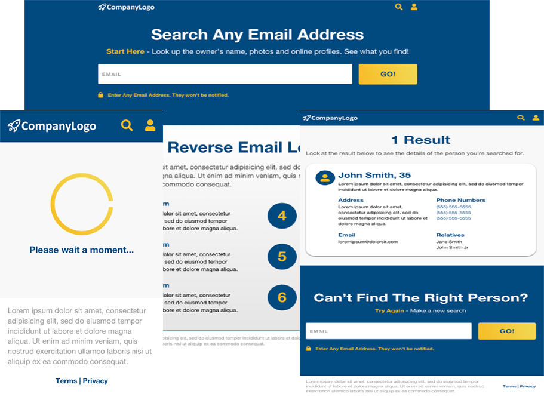

# Responsive-UI-Test



## About

This project is responsive & user friendly UI using HTML, CSS, Bootstrap, Javascript and JQuery.

## Quick Start
```bash
# clone the repo
$ git clon https://github.com/julian-kunzig/Responsive-UI-Test.git

# move to directory
$ cd Responsive-UI-Test

# Run the project
Current project has index.php instead of index.html because of deploying to heroku.

- PHP Run
$ php -S 127.0.0.1:8000

- Python Run
$ python3 -m http.server
```

## Visit to the app
https://responive-ui-test.herokuapp.com/